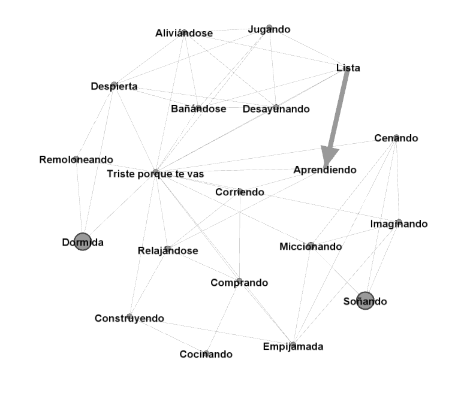

# Descripción del conocimiento del dominio

El tema elegido, contextualizado dentro de *"la familia"* (propuesto por el equipo docente), sería *"los hijos"* 
(previamente aprobado). En concreto, está basado en mi hija de tres años (Lucía). El conocimiento del dominio se ha 
extraído de mi experiencia como padre en el día a día de la vida con la niña. No está exento de humor, puesto que en 
la realidad tampoco lo está. Se ha tratado de simplificar al máximo para permitir concretar los límites del programa,
 que de otra forma podría ser de una complejidad inabarcable.
 
El formato del programa es el de un juego o simulación en el que se asume el papel de padre de la niña en un día de asueto (o de trabajo) de la madre, con lo que no se dispondrá de su inestimable ayuda (el papá está solo ante el peligro). 

El objetivo es tratar de minimizar la penalización por tiempo requerido por la niña a lo largo de todo el día para que el papá disponga del mayor intervalo posible para estudiar sus asignaturas de la UNED. Es decir, conseguir que la niña se duerma pronto y esté contenta y con sus necesidades básicas satisfechas. 

Se modela la personalidad de la niña como una sencilla máquina  de estados (ojalá fuera así de sencilla la realidad; aquí se trata de un modelo simplificado). Además, a lo largo del paso por todos los estados se dispone de una serie de indicadores vitales básicos (a saber: humor, hambre, sueño y ganas de hacer pis). Las transiciones entre estados se corresponden con las posibles acciones que puede realizar el padre, introducidas a través del teclado. Las distintas acciones posibles implican distintas penalizaciones y reducciones o incrementos de los valores de los indicadores. Si se sobrepasan ciertos umbrales de los indicadores, es muy posible que las consecuencias para el objetivo del juego sean nefastas (por ejemplo, que la niña se haga pis encima supondrá una penalización por tiempo considerable).

Podría plantearse que ciertas consideraciones no son realistas; por ejemplo, ¿qué importancia puede tener que la niña se haga pis por la mañana de cara a que se vaya a dormir pronto? En el fondo se trata tan sólo de una excusa para que el juego funcione, no habiéndose considerado necesario llegar hasta esos extremos de realismo.
 
 A continuación se incluye un grafo representando el diagrama de estados que forma la práctica totalidad de la base de hechos, con estado inicial `dormida` y estado final `soñando`:
 
 
  
# Descripción de la estructura de base de reglas
 
Con respecto a la base de conocimiento, se dispone de los siguientes bloques de predicados a modo de reglas: 
 
## Módulo de control del programa:

Contiene predicados que se encargan de gestionar la entrada de acciones por el teclado, la ejecución de las mismas y la comprobación del estado de los indicadores básicos.

- control_principal: predicado recursivo que se encarga de pedir la entrada al usuario, comprobar las indicadores y ejecutar las acciones correspondientes.
- condicion_fin: condiciones de fin para el predicado recursivo (fin de juego o salida explícita).

## Módulo de eventos o sucesos:
Determina lo que ocurre en cada estado al que se transiciona. Actualiza los indicadores y la penalización en consecuencia.
 - sucesos(Accion, EstadoAnterior, Estado): presenta una serie de acciones y comprobaciones que se llevan a cabo por cada uno de los estados a los que se transiciona.
 
 
## Módulo de indicadores y penalización:
 
Contiene toda una serie de predicados que modifican y/o listan los indicadores y la penalización por tiempo.
 
 - check_indicadores: comprueba los valores de los indicadores y aplica las penalizaciones si estos sobrepasan una serie de umbrales.
 - check_humor: comprobador específico del indicador humor a la salida del colegio.
 - check_humor_pijama: comprobador específico del indicador humor antes de poner el pijama.
 - check_pasada_de_vueltas: comprobador específico del indicador sueño antes de ir a dormir.
 - penaliza_pis: penalización por tiempo cuando el indicador del pis supera el valor 80.
 - penaliza_hambre: penalización por tiempo cuando el indicador de hambre supera el valor 80.
 - penaliza_humor: penalización por tiempo cuando el indicador de humor no llega a 30.
 - penaliza(Valor): aumenta el contador de penalización en un valor.
 - incrementa_indicador(Valor,Indicador): incrementa el valor de un indicador en el valor proporcionado.
 - reduce_indicador(Indicador,Valor): reduce el valor de un indicador en el valor proporcionado.
 - reemplaza_indicador(Indicador,Valor): reemplaza el valor de un indicador por el valor proporcionado.
 - cambia_sueño(R): aleatoriamente decide si la niña ha dormido bien o no, ajustando el indicador de sueño en consecuencia.
 - print_par(Clave,Valor): predicado genérico que permite escribir a consola un par clave-valor. Útil para listar los estados posibles y los indicadores.

## Módulo de gestión de estados
 
Contiene predicados relacionado con las transiciones entre estados, la comprobación de estados posibles desde uno dado, el listado de transiciones, la salida a consola, etc.
  
 - actualiza_estados(Lista,Estado)
 - puedo_hacer(Estado)
 - cambiar(Estado)
 - hacer(Accion)
 - listar_transiciones(Estado, VisitadosMatutinos, VisitadosVespertinos)
 - que_hago(Accion, EstadoAnterior, Estado)

# Metodología del desarrollo

Si bien se trata de un sistema muy sencillo, para el desarrollo del mismo se ha buscado inspiración en CommonKADS, 
una metodología para la construcción de sistemas basados en el conocimiento. Dada su complejidad y extensión no se 
han usado todos los artefactos, pero sí los que se han considerado como más importantes a la hora de realización de 
la práctica. Básicamente, se el desarrolo del sistema se ha llevado a cabo de la siguiente forma:

- Definición del sistema a nivel contextual
- Definición del modelo de conocimiento
- Implementación en Prolog
- Documentación y pruebas

# Requisitos del sistema

Por cada uno de los miembros del grupo de trabajo en el sistema se habrán de definir:

- 2 o más constantes: una constante puede ser un átomo o un número. En el programa actual, hay definidas varias constantes: `dormida`, `despierta`, `hecho_pis`, etc. 
- 2 o más hechos con variables: `transicion('salir', 'salir', Estado, fin).`, TODO
- 2 o más hechos sin variables: `transicion('despertar', 'despertarla', dormida, despierta).`, `transicion('banyar', 'dejarla dormir un poco más', dormida, despierta).`
- 5 o más predicados: por ejemplo, `check_indicadores`, `sucesos`, `hacer`, `que_hago`, `condicion_fin`.

Y deberán verificarse las siguientes condiciones:

- al menos uno de los predicados habrá de definirse mediante 2 o más reglas: por ejemplo, el predicado `control_principal(Estado)`.
- al menos uno de los predicados deberá tener 2 o más argumentos: como por ejemplo, `que_hago(EstadoAnterior, Estado)`.
- 2 o más reglas deberán constar de 2 o más antecedentes: por ejemplo, la regla cuya cabeza es el predicado `lucia` o la regla cuya cabeza es el predicado `cambia_sueño`.
- la satisfacción de 2 o más objetivos habrá de requerir el encadenamiento de 2 o más reglas: por ejemplo, los objetivos `que_hago(EstadoAnterior,NuevoEstado)` y `control_principal(NuevoEstado)` del predicado `control_principal`.

El sistema deberá contener además:

- Al menos un ejemplo de uso de uno de los operadores aritméticos o relacionales predefinidos: por ejemplo, en el predicado `cambia_sueño` se utiliza la suma.
- Al menos un ejemplo de recursividad: por ejemplo, el predicado `control_principal`, que se llama a sí mismo en cada estado o fase del programa hasta que llega al estado final en el que termina el mismo.
- Al menos un ejemplo de uso de los predicados de inserción y borrado de hechos de la Base de Hechos: por ejemplo, los contadores de puntuaciones (`humor`, `sueño`, etc.). Para actualizarse, primero se retractan y luego vuelven a añadirse como hechos pero con distintos valores.

# Código fuente

# Casos de prueba

# Conclusiones y valoración