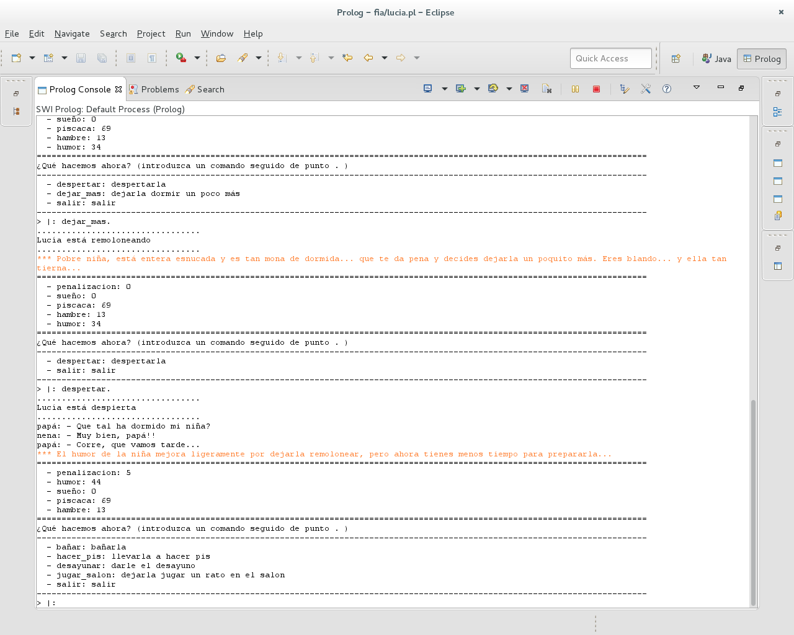
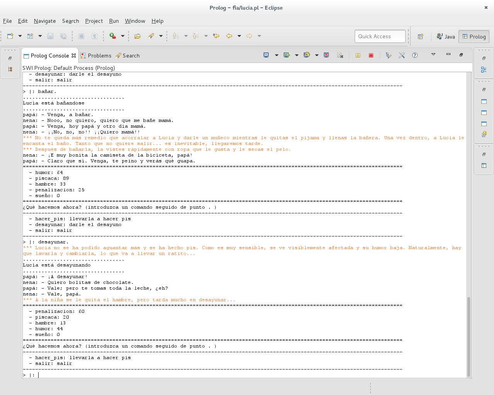
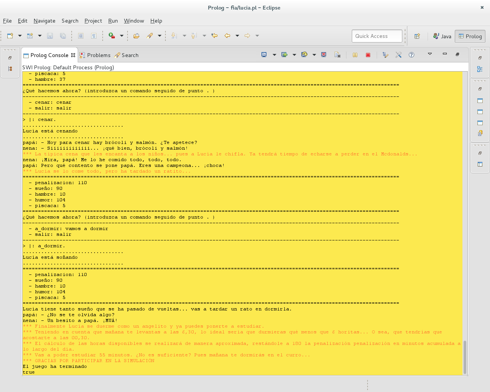

% Fundamentos de Inteligencia Artificial
% Actividad obligatoria II: Construcción en Prolog de un Sistema Basado en Reglas Básico 
% Miguel Expósito Martín - 72056097H

# Descripción del conocimiento del dominio

El tema elegido, contextualizado dentro de *"la familia"* (propuesto por el equipo docente), sería *"los hijos"* 
(previamente aprobado). En concreto, está basado en mi hija de tres años (Lucía). El conocimiento del dominio se ha 
extraído de mi experiencia como padre en el día a día de la vida con la niña. No está exento de humor, puesto que en 
la realidad tampoco lo está. Se ha tratado de simplificar al máximo para permitir concretar los límites del programa,
 que de otra forma podría ser de una complejidad inabarcable.
 
El formato del programa es el de un juego o simulación en el que se asume el papel de padre de la niña en un día de asueto (o de trabajo) de la madre, con lo que no se dispondrá de su inestimable ayuda (el papá está solo ante el peligro). 

El objetivo es tratar de minimizar la penalización por tiempo requerido por la niña a lo largo de todo el día para que el papá disponga del mayor intervalo posible para estudiar sus asignaturas de la UNED. Es decir, conseguir que la niña se duerma pronto y esté contenta y con sus necesidades básicas satisfechas. 

Se modela la personalidad de la niña como una sencilla máquina  de estados (ojalá fuera así de sencilla la realidad; aquí se trata de un modelo simplificado). Además, a lo largo del paso por todos los estados se dispone de una serie de indicadores vitales básicos (a saber: humor, hambre, sueño y ganas de hacer pis). Las transiciones entre estados se corresponden con las posibles acciones que puede realizar el padre, introducidas a través del teclado. Las distintas acciones posibles implican distintas penalizaciones y reducciones o incrementos de los valores de los indicadores. Si se sobrepasan ciertos umbrales de los indicadores, es muy posible que las consecuencias para el objetivo del juego sean nefastas (por ejemplo, que la niña se haga pis encima supondrá una penalización por tiempo considerable).

Podría plantearse que ciertas consideraciones no son realistas; por ejemplo, ¿qué importancia puede tener que la niña se haga pis por la mañana de cara a que se vaya a dormir pronto? En el fondo se trata tan sólo de una excusa para que el juego funcione, no habiéndose considerado necesario llegar hasta esos extremos de realismo.

La simulación es autoexplicativa, por lo que no se incluyen más instrucciones explícitas que las de la introducción de comandos por el teclado. Si bien determinadas acciones pueden tener resultados imprevisibles a priori (como, por ejemplo, que si la niña tiene mucho sueño por la noche tarde más en dormirse, curiosamente), estos no dejan de formar parte de la vida real y se aprenden así: viviéndolo. Por tanto, con un poco de sentido común y un par de ejecuciones de la simulación es posible llegar a obtener unos resultados razonables (aunque hay factores aleatorios que escapan a las posibilidades de acción de los padres).
 
 A continuación se incluye un grafo representando el diagrama de estados que forma la práctica totalidad de la base de hechos, con estado inicial `dormida` y estado final `soñando`:
 
 
 
 Por otra parte se tienen los distintos contadores (indicadores básicos y penalización), introducidos como hechos de la forma `contador(indicador,valor)` que se inicializan así:
 
 - Contador humor: número aleatorio del 0 al 100.
 - Contador hambre: número aleatorio del 0 al 100.
 - Contador pis/caca: número aleatorio del 0 al 100.
 - Contador sueño: 0. Al despertar, en principio, no tiene prácticamente sueño (salvo que haya dormido mal, hecho que se tiene en cuenta posteriormente).
 - Contador penalización: 0.
 
 Los contadores no han sido acotados superior ni inferiormente puesto que se considera no aporta demasiado al realismo del modelo (estará prácticamente igual de contenta con 100 que con 120; no es significativo). 
 
Antes de la ejecución del bucle principal del programa, se retractan e inicializan todas las variables relevantes para evitar conflictos con simulaciones anteriores.

\pagebreak
  
# Descripción de la estructura de base de reglas
 
Con respecto a la base de conocimiento, se dispone de los siguientes bloques de predicados a modo de reglas: 

## Módulo de inicialización

Contiene predicados que se encargan de inicializar determinados aspectos de la base de hechos y de presentar el programa:

- `inicio`: retracta posibles hechos de simulaciones anteriores que pudieran interferir con la actual y los inicializa aleatoriamente.
- `lucia`: muestra por consola la presentación del programa y carga el control principal del programa.
 
## Módulo de control del programa

Contiene predicados que se encargan de gestionar la entrada de acciones por el teclado, la ejecución de las mismas y la comprobación del estado de los indicadores básicos.

- `control_principal(EstadoAnterior)`: predicado recursivo que se encarga de pedir la entrada al usuario, comprobar las indicadores y ejecutar las acciones correspondientes.
- `condicion_fin(Estado)`: condiciones de fin para el predicado recursivo (fin de juego o salida explícita).

## Módulo de eventos o sucesos
Determina lo que ocurre en cada estado al que se transiciona. Actualiza los indicadores y la penalización en consecuencia.
 - `sucesos(Accion, EstadoAnterior, Estado)`: presenta una serie de acciones y comprobaciones que se llevan a cabo por cada uno de los estados a los que se transiciona.
 
 
## Módulo de indicadores y penalización
 
Contiene toda una serie de predicados que modifican y/o listan los indicadores y la penalización por tiempo.
 
 - `check_indicadores`: comprueba los valores de los indicadores y aplica las penalizaciones si estos sobrepasan una serie de umbrales.
 - `check_humor`: comprobador específico del indicador humor a la salida del colegio.
 - `check_humor_pijama`: comprobador específico del indicador humor antes de poner el pijama, pudiendo darse una penalización.
 - `check_pasada_de_vueltas`: comprobador específico del indicador sueño antes de ir a dormir.
 - `penaliza_pis`: penalización por tiempo cuando el indicador del pis supera el valor 80.
 - `penaliza_hambre`: penalización por tiempo cuando el indicador de hambre supera el valor 80.
 - `penaliza_humor`: penalización por tiempo cuando el indicador de humor no llega a 30.
 - `penaliza(Valor)`: aumenta el contador de penalización en un valor.
 - `incrementa_indicador(Valor,Indicador)`: incrementa el valor de un indicador en el valor proporcionado.
 - `reduce_indicador(Valor, Indicador)`: reduce el valor de un indicador en el valor proporcionado.
 - `reemplaza_indicador(Valor, Indicador)`: reemplaza el valor de un indicador por el valor proporcionado.
 - `cambia_sueño(R)`: aleatoriamente decide si la niña ha dormido bien o no, ajustando el indicador de sueño en consecuencia.
 - `print_par(Clave,Valor)`: predicado genérico que permite escribir a consola un par clave-valor. Útil para listar los estados posibles y los indicadores.

\pagebreak

## Módulo de gestión de estados
 
Contiene predicados relacionado con las transiciones entre estados, la comprobación de estados posibles desde uno dado, el listado de transiciones, la salida a consola, etc.
  
 - `actualiza_estados(Lista,Estado)`: añade un estado determinado a una lista de estados visitados (matutinos o vespertinos en función del momento del día en que se recorran).
 - `puedo_hacer(Estado)`: comprueba si es válida la transición de un estado a otro.
 - `cambiar(Estado)`: modifica el estado actual por uno dado.
 - `hacer(Accion)`: modela la transición de un estado a otro, comprobando previamente su validez.
 - `listar_transiciones(Estado, VisitadosMatutinos, VisitadosVespertinos)`: muestra en la consola la lista de acciones o transiciones posibles desde el estado actual.
 - `que_hago(Accion, EstadoAnterior, Estado)`: indica en qué estado se encuentra la niña y muestra los valores de los indicadores básicos en el estado actual, así como las transiciones posibles desde dicho estado.

\pagebreak

# Metodología del desarrollo

Si bien se trata de un sistema muy sencillo, para el desarrollo del mismo se ha buscado inspiración en CommonKADS, una metodología para la construcción de sistemas basados en el conocimiento. Dada su complejidad y extensión no se han usado todos los artefactos, pero sí los que se han considerado como más importantes a la hora de realización de la práctica. Básicamente, se el desarrolo del sistema se ha llevado a cabo de la siguiente forma:

## Definición del sistema a nivel contextual

En esta fase, básicamente se ha llevado a cabo el análisis de los requisitos del enunciado y el planteamiento del tema elegido. Para poder comprender dichos requisitos, ha sido necesario estudiar previamente la sintaxis y funcionamiento de Prolog. Posteriormente, se ha esbozado el formato del programa, el objetivo y el alcance. Se ha procurado no complicar en exceso el desarrollo del mismo entrando en mucho detalle, pero a la vez ofrecer un conjunto de características suficientes y razonables. También se ha pensado en distintos mecanismos para dar cumplimiento a los requisitos más complicados desde un punto de vista técnico (como implementar ejemplos de recursividad). Asimismo, se ha planteado un diseño de alto nivel del contenido de la base de hechos (máquina de estados) y de conocimiento (funcionalidad de indicadores, gestión de estados, etc.).

Otra decisión importante tomada en esta fase ha sido la elección de la implementación y entorno de desarrollo de Prolog. En este sentido, se ha optado por usar un complemento para el IDE Eclipse ([Prolog Development Tool](http://sewiki.iai.uni-bonn.de/research/pdt/docs/start)) así como la implementación libre [SWI-Prolog](http://www.swi-prolog.org/). Los motivos de su elección son la gran aceptación de ambos en la comunidad de programadores Prolog, así como la comodidad del resaltado de sintaxis y apoyo a la depuración de errores de Eclipse.

## Definición del modelo de conocimiento

Una vez planteado el contexto, se ha definido el modelo de conocimiento a través de un borrador de diagrama de estados. Esta fase, junto con las sucesivas, se han llevado a la práctica de forma iterativa e incremental:

- Refinado del modelo de conocimiento
- Implementación de característica concreta
- Prueba de característica
- Documentación

## Implementación en Prolog

Para la implementación en Prolog se han utilizado los recursos proporcionados por el Equipo Docente y otros muchos disponibles en Internet (ej: [StackOverflow](http://stackoverflow.com/). El enfoque incremental e iterativo utilizado ha permitido desarrollar funcionalidad con cierta agilidad, mientras que se han ido adquiriendo los conocimientos y la práctica suficientes como para mejorarlo refactorizándolo en sucesivas iteraciones. Dichas refactorizaciones han consistido, por ejemplo, en fusionar varios predicados en uno sólo aumentando su parametrización, o encapsular reglas con entidad suficiente en predicados independientes.

## Documentación y pruebas

Paralelamente al desarrollo de la práctica se han ido documentando los requisitos cumplidos y realizando pruebas de la funcionalidad implementada. Dado el alcance limitado de los casos de prueba, no se ha considerado necesario automatizarlos, sino que se han realizado manualmente con la consola del intérprete.

\pagebreak

# Requisitos del sistema

Por cada uno de los miembros del grupo de trabajo en el sistema se habrán de definir:

- 2 o más constantes: una constante puede ser un átomo o un número. En el programa hay definidas varias constantes: `dormida`, `despierta`, `hecho_pis`, etc. 
- 2 o más hechos con variables: también hay varios; `transicion('salir', 'salir', Estado, fin).`, `actual(NuevoEstado)`, etc.
- 2 o más hechos sin variables: por ejemplo, todas las transiciones; `transicion('despertar', 'despertarla', dormida, despierta).`, `transicion('bañar', 'dejarla dormir un poco más', dormida, despierta).`
- 5 o más predicados: por ejemplo, `check_indicadores`, `sucesos`, `hacer`, `que_hago`, `condicion_fin`.

Y deberán verificarse las siguientes condiciones:

- Al menos uno de los predicados habrá de definirse mediante 2 o más reglas: por ejemplo, el predicado `control_principal(Estado)` se define mediante dos reglas.
- Al menos uno de los predicados deberá tener 2 o más argumentos: como por ejemplo, `que_hago(EstadoAnterior, Estado)`.
- 2 o más reglas deberán constar de 2 o más antecedentes: por ejemplo, la regla cuya cabeza es el predicado `lucia` o la regla cuya cabeza es el predicado `cambia_sueño`.
- la satisfacción de 2 o más objetivos habrá de requerir el encadenamiento de 2 o más reglas: por ejemplo, los objetivos `que_hago(EstadoAnterior,NuevoEstado)` y `control_principal(NuevoEstado)` del predicado `control_principal`.

El sistema deberá contener además:

- Al menos un ejemplo de uso de uno de los operadores aritméticos o relacionales predefinidos: por ejemplo, en el predicado `penaliza(Valor)` se utiliza la suma.
- Al menos un ejemplo de recursividad: por ejemplo, el predicado `control_principal`, que se llama a sí mismo en cada estado o fase del programa hasta que llega al estado final en el que termina la recursividad.
- Al menos un ejemplo de uso de los predicados de inserción y borrado de hechos de la Base de Hechos: por ejemplo, los contadores de puntuaciones (`contador(humor,X)`, `contador(sueño,X)`, etc.). Para actualizarse, primero se retractan y luego vuelven a añadirse como hechos pero con distintos valores.

\pagebreak

# Código fuente

\pagebreak

# Casos de prueba

## Inicio y control del programa

El predicado `inicio` realiza una inicialización de la base de hechos mediante `asserta` y `retractall`. Posteriormente, se utiliza un hecho con variable `actual(Estado)` y se llama al predicado `que_hago(_,Estado, Estado)`, con tres argumentos y que a su vez encadena con `sucesos(Accion,EstadoAnterior,Estado)`, este con `cambia_sueño(R)`, y este a su vez encadena con `incrementa_indicador(10,sueño)`. También se llama al predicado `control_principal(Estado)`, de tipo recursivo y que queda a la espera de entrada de datos por el teclado por parte del usuario. A continuación se incluye una captura como muestra de su correcto funcionamiento:

\pagebreak

## Transiciones entre estados

A continuación, el usuario elige una acción; por ejemplo, `dejar_mas`. El resultado esperado es que el humor mejore y la penalización aumente. Sin embargo, el usuario no lo visualizará por consola hasta que no esté despierta. Por lo tanto, se introduce también el comando `despertar`.

En la captura se puede comprobar cómo, efectivamente, la penalización ha subido en 5 y el humor en 10.

\pagebreak

Las siguientes transiciones son todas muy similares en cuanto a funcionalidad: se muestran conversaciones y situaciones en la consola y se modifican los indicadores y la penalización en consecuencia. Especial mención merece el sistema para evitar que se pueda pasar más de una vez por los estados mostrados (una lista con estados visitados). Se puede comprobar su correcto funcionamiento seleccionando una acción y confirmando que, en la siguiente elección, esta ya no aparecerá. Por ejemplo, se selecciona `jugar_salon` y se comprueba cómo esta acción no vuelve a aparecer en el listado siguiente. 

\pagebreak

Para probar el predicado `check_indicadores`, que contiene varios hechos con Variable, una estructura condicional y encadena con otras reglas (como `penaliza_hambre` o `penaliza_humor`, se irán seleccionando todas las opciones que no sean `hacer_pis` para conseguir que el indicador del pis suba y llegue al umbral.

\pagebreak

Al haber recorrido todos los estados denominados "matinales", se introduce dinámicamente un nuevo hecho con una transición nueva mapeada con la acción `ir_cole`. Una vez alcanzado el estado `aprendiendo`, se produce una reinicialización de los indicadores básicos vitales (puesto que en el cole pueden haber cambiado muchas cosas). Los estados subsiguientes no aportan prácticamente nada nuevo en cuanto a funcionalidad (siguen modificándose los valores de indicadores y penalizaciones). Sí es interesante probar el mecanismo de transición de estados vespertinos, similar al de estados matutinos comprobado anteriormente. Se introducen en el programa una serie de acciones hasta llegar a este punto en el flujo del mismo:

\pagebreak

## Fin del programa

Se puede comprobar cómo, una vez visitado un estado (ej., a través de las acciones `cenar` o `hacer_caca`) este desaparece de la lista de opciones. Una vez más, como en el caso de los estados vespertinos, la visita al último estado disponible dispara la creación de un nuevo hecho con la transición final, `a_dormir`. 

\pagebreak

En el mensaje de finalización se muestra la penalización obtenida sin emitir ningún juicio de valor acerca de si son muchas o pocas horas disponibles (de hecho, el propio programa deja esto a criterio del usuario, puesto que no todos necesitamos las mismas horas de estudio).

\pagebreak

## Salida del programa y re-ejecución
 
Cabe destacar que existe una acción ejecutable desde todos los estados y que lleva a un mismo estado de terminación del programa (esta vez por deseo del usuario, no siguiendo su flujo natural). Para probar dicha acción, basta con iniciar de nuevo el programa y teclear la acción `salir.` En esta prueba, también se puede confirmar que la simulación anterior no interfiere con la nueva, inicializándose la base de hechos convenientemente para el caso.

\pagebreak

# Conclusiones y valoración

Las mayores dificultades las he encontrado a la hora de elegir un tema y pensar en el programa a implementar. No me considero una persona creativa en el sentido de generar un producto nuevo; sí creo que tengo más capacidades a la hora de plantear soluciones a problemas ya propuestos. Me habría resultado más sencillo enfrentarme a un problema concreto; para mí, el enunciado es demasiado abierto.

Dicho esto y solucionada la elección del tema, el aprendizaje de Prolog ha sido menos arduo de lo que esperaba (quizá gracias a que el cuatrimestre anterior tuve que realizar prácticas con CLIPS, otro entorno basado en reglas). No obstante, me sigue resultando complicado adaptarme al paradigma de programación orientada a reglas, ya que la práctica todalidad de mi experiencia con lenguajes de programación se encuadra en orientación a objetos y/o programación estructurada.

De la aproximación metodológica aplicada, lo que más me ha ayudado ha sido el enfoque iterativo e incremental. Este enfoque me ha permitido avanzar en el desarrollo de funcionalidad con solvencia, así como dejar la refactorización y mejora del código para momentos posteriores, cuando mi experiencia y conocimiento eran mayores. 

Creo que Prolog es un lenguaje muy potente que me gustaría explorar en mayor profundidad si tuviera la oportunidad. Quizá el aspecto idiomático que más me ha llamado la atención es la forma de tratar condicionales con reglas, prácticamente eliminando la necesidad de utilizar estructuras `if-then-else` (véase por ejemplo el predicado `sucesos`). En la práctica he utilizado en ocasiones la estructura específica que proporciona Prolog con el único objeto de tener un código más compacto. Quizá echaría en falta haber visto un ejemplo de caso de uso real de Prolog, al margen de juegos y simulaciones, para hacerme una idea de qué tipo de problemas puede resolver en ámbitos industriales o de investigación, por ejemplo (así como su posible integración con otras tecnologías como aplicaciones web, Java, etc.).
